Preprocessing Fitfiles
================
Matthew Hull
2018-07-31

Distance from the fitfile was expressed in meters, converted to miles.
Time is converted from seconds to hours.

``` r
df$total_distance = df$total_distance * .000621
df$total_timer_time = round((df$total_timer_time / 60) / 60,2)
df['mph'] = round(df$total_distance / df$total_timer_time,1)
```

Original values from fitfile converted to the desired fields TODO: make
this into table. \# timestamp = timestamp \# total\_timer\_time =
duration \# total\_distance = totalDistance \# total\_calories =
totalEnergyBurned \# source = sourceName.x \# avg\_heart\_rate =
hr\_value \# sport = workoutType

Explore total records, workouts per month, etc.

``` r
ggplot(df, aes(month)) + 
  geom_bar(aes(fill=month),show.legend = F, width=.8) +
  scale_fill_viridis(discrete = T,direction=-1) +
  ylab("Count") +
  xlab("Month") +
  ggtitle("All Time Total Workouts per Month")
```

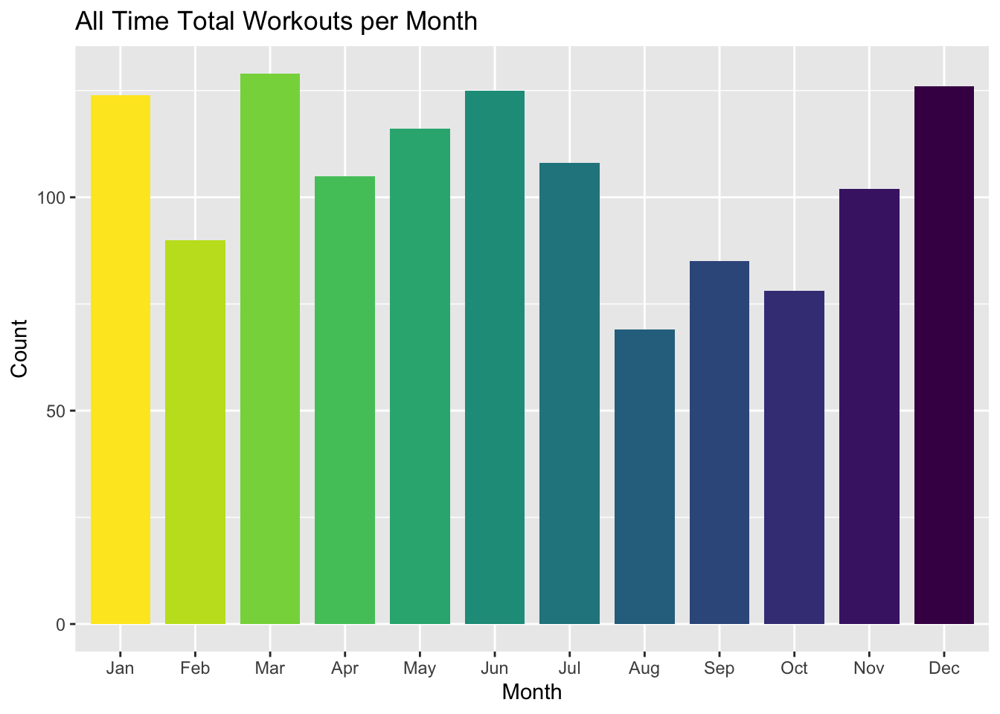

``` r
ggplot(df, mapping=aes(duration)) + 
  geom_density() + 
  geom_vline(data=df, aes(xintercept = mean(df$duration))
           , color="purple"
           , size=0.75
           , alpha=0.60
           , lty="dashed") +  
  facet_wrap(~month) +
  ggtitle("Workout Duration by Month")
```

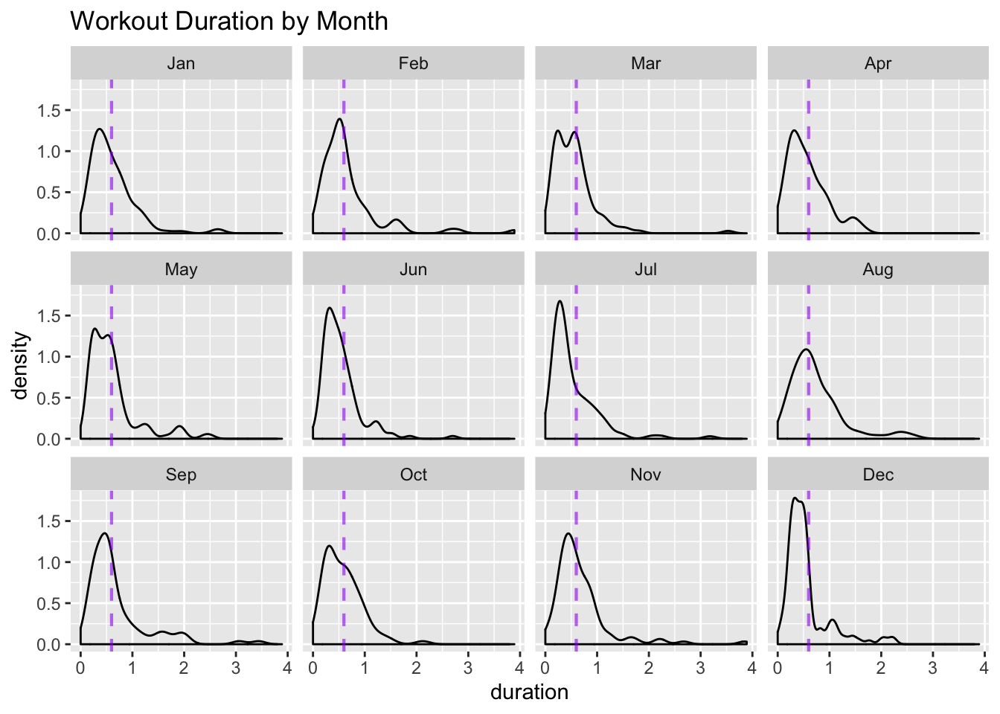

``` r
dist_df <- subset(df, !is.na(totalDistance))

p1 <- ggplot(dist_df, aes(month, totalDistance)) + 
  geom_boxplot(aes(fill=month),show.legend=F) +
  scale_fill_viridis(discrete = T,direction = -1) +
  theme_bw() +
  xlab("Month") +
  ylab("Distance") +
  ggtitle("Workout Distance by Month")

dat1 <- ggplot_build(p1)$data[[1]]

p1 + geom_segment(data=dat1, aes(x=xmin, xend=xmax, y=middle, yend=middle), color='white',size=.5)
```

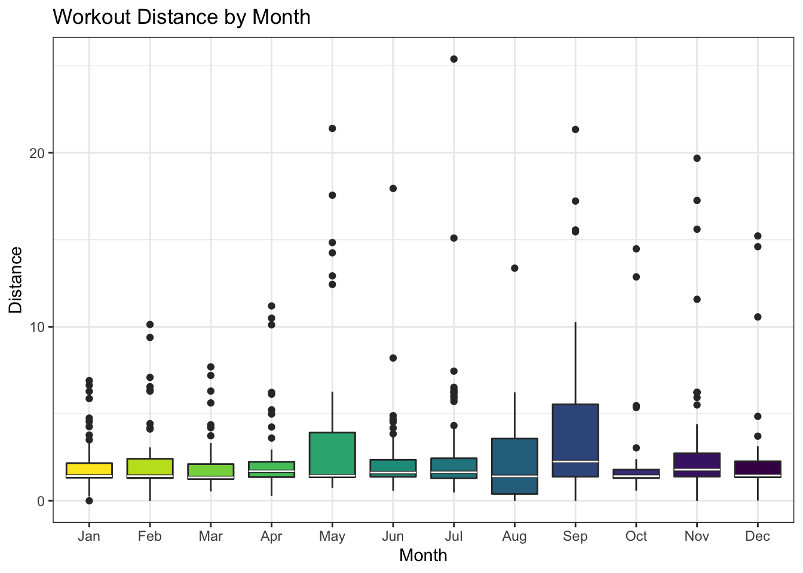

In some cases, the totalEnergyBurned variable was not included. The
Fitfile shows values of ‘0’ in these instances. Due to the large number
of missing values, I decided to calculate the calorie burns by using the
Compendium of Physical Activities provided by the National Institutes of
Health (NIH).

## Missing Data

``` r
ggplot(df, aes(ymd,hr_value)) +
  geom_bar(stat='identity') +
  geom_vline(color='red', xintercept=df$ymd[which(is.na(df$hr_value))]) +
  ylab("Heart Rate") +
  xlab("Workout Date") +
  ggtitle("Missing HR Observations over Time")
```

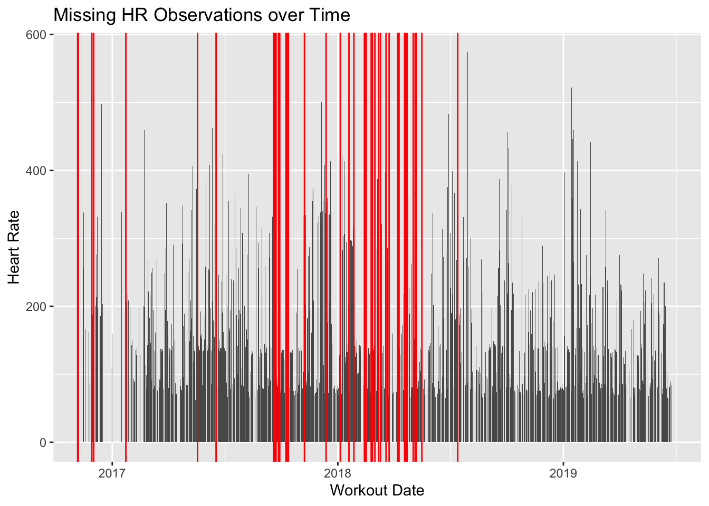

``` r
ggplot(df, aes(ymd,totalEnergyBurned)) +
  geom_bar(stat='identity') +
  geom_vline(color='blue', xintercept=df$ymd[which(is.na(df$hr_value))]) +
  ylab("Calories") +
  xlab("Workout Date") +
  ggtitle("Missing Calorie Burn Observations over Time")
```

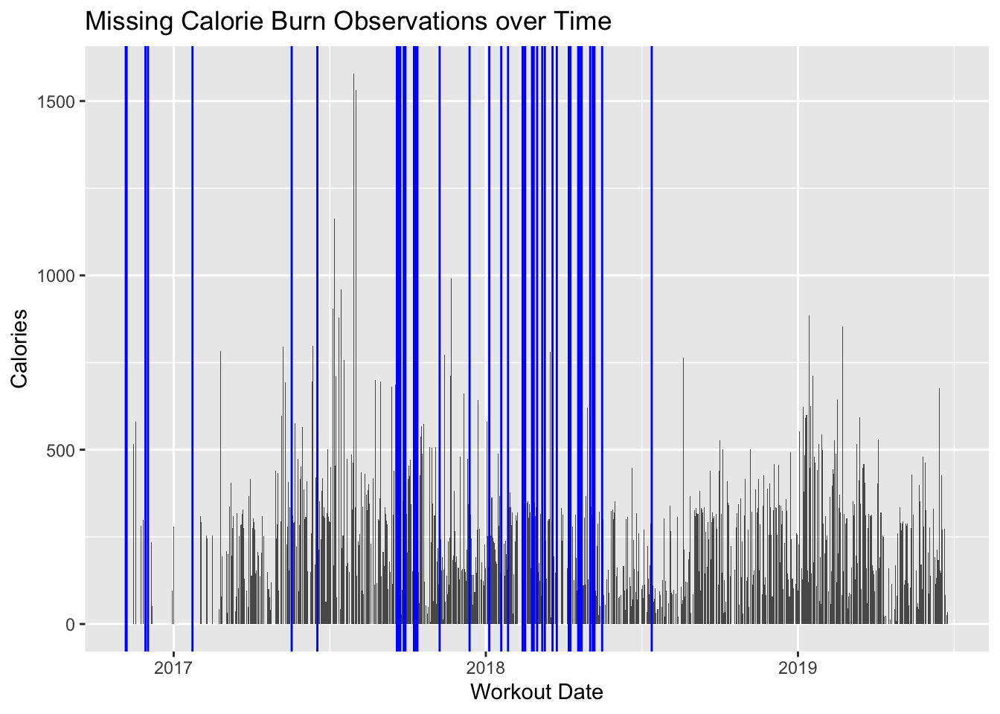

<More about how to calculate a calorie burn using a MET>

A mph speed variable was calculated from the distance and duration
fields since the metabolic equivalents (METS) used miles per hour (mph).
Next, the closest MET is selected based on the activity (running or
cycling) and mph value that best matched.

<Example MET match>

### calculate calories

calories = (kg \* MET) \* (min/60) from
<https://download.lww.com/wolterskluwer_vitalstream_com/PermaLink/MSS/A/MSS_43_8_2011_06_13_AINSWORTH_202093_SDC1.pdf>

``` r
physical_activity <- read.csv('compendium_physical_activity_partial.csv', header=T,sep=",")
df['mets'] = NA
cycling_mets = subset.data.frame(physical_activity, major_heading=='bicycling')
running_mets = subset.data.frame(physical_activity, major_heading=='running')
for (i in 1:nrow(df)) {
# filter by cycling or running in physical_activity table
  if(df[i,'workoutType']=='running'){
    for (j in 1:nrow(running_mets)) {
      spd <- df[i,'mph']
      min <- running_mets[j,'min']
      max <- running_mets[j,'max']
      m <- inside.range(spd,range(min,max))
      if (is.na(m)) { m <- F }
      if (m){
        #print(paste("spd: ",spd," min: ",min," max: ",max," mets: ",running_mets[j,'mets']))
        df[i,'mets'] <- running_mets[j,'mets']
      }
    }
  }
  else if (df[i,'workoutType']=='cycling'){
    for (k in 1:nrow(cycling_mets)){
      spd <- df[i,'mph']
      min <- cycling_mets[k,'min']
      max <- cycling_mets[k,'max']
      m <- inside.range(spd,range(min,max))
      if (is.na(m)) { m <- F }      
      if (m){
        # print(paste("spd: ",spd," min: ",min," max: ",max," mets: ",cycling_mets[k,'mets']))
        df[i,'mets'] <- cycling_mets[k,'mets']
      }      
    }
  }
}
```

``` r
# calories = (kg * MET) * (min/60)
my_weight <- 65
df['estTotalEnergyBurned'] <- (my_weight * df['mets']) * df['duration']

# compare distributions of calculated vs. actual
actual_cals <- subset.data.frame(df,
                                 (df$workoutType == 'cycling' || df$workoutType == 'running') &
                                   (df$totalEnergyBurned > 0))


calculated_cals_grouped <- aggregate(estTotalEnergyBurned ~ workoutType, data=df, median)
actual_cals_grouped <- aggregate(totalEnergyBurned ~ workoutType, data=actual_cals, median)
print("Calculated Calories:")
print(calculated_cals_grouped)
print("Actual Calories:")
print(actual_cals_grouped)

# average cycling actual calories
actual_cals_grouped$totalEnergyBurned[actual_cals_grouped$workoutType == 'cycling']
calculated_cals_grouped$estTotalEnergyBurned[calculated_cals_grouped$workoutType == 'cycling']

ggplot(subset(actual_cals, workoutType=='cycling'), mapping = aes(estTotalEnergyBurned)) + 
  geom_density(mapping=aes(totalEnergyBurned, fill='red'), data=subset(df,workoutType=='cycling'),alpha=.7,color=NA) +
  geom_density(alpha=.7,color=NA, aes(fill='blue')) +
  xlab("Calories") +
  scale_fill_identity(name='', guide = 'legend', labels=c('calc cals','actual cals')) +
  scale_colour_manual(name = 'the colour', values =c('blue'='blue','red'='red')) +
  theme_bw() +
  ggtitle('Total and Calculated Energy Burns - Cycling')
```

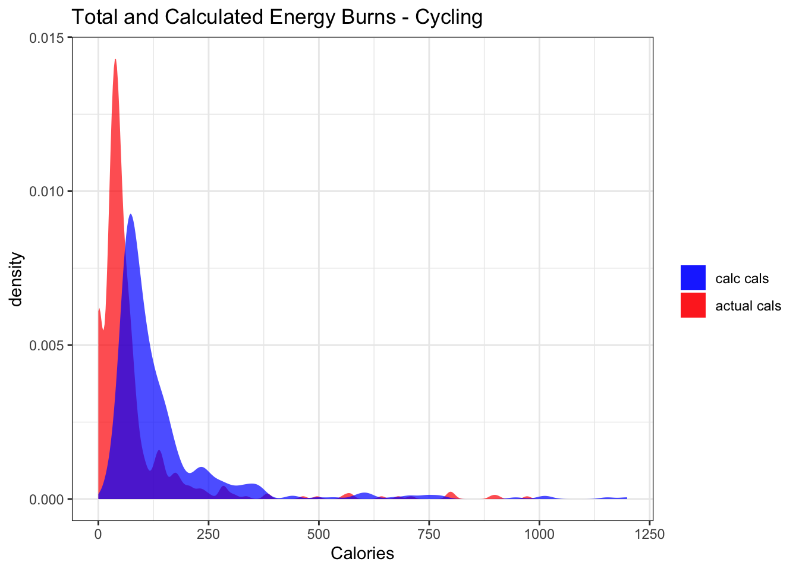

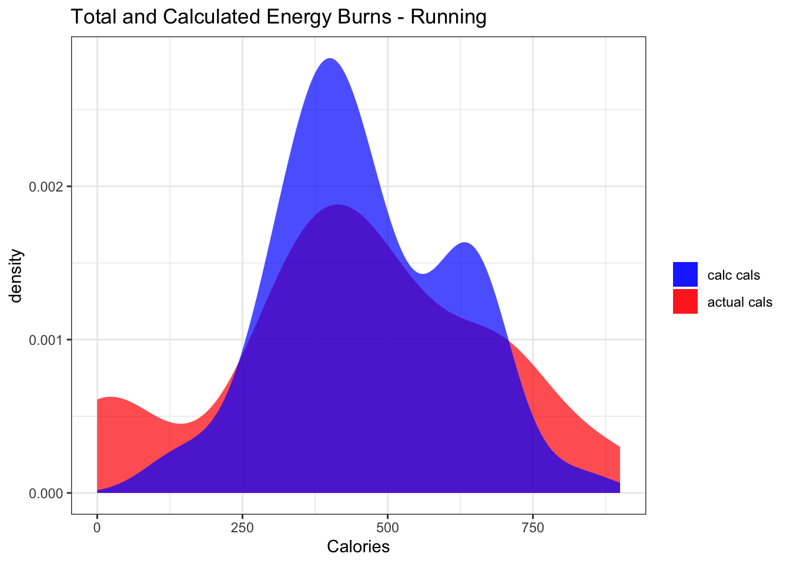

``` r
ggplot(df, aes(ymd,totalEnergyBurned)) +
  geom_bar(data=df, aes(ymd,estTotalEnergyBurned,fill='blue'), stat='identity',alpha=.7) +  
  geom_bar(stat='identity',aes(fill='red'),alpha=.7) +
  ylab("Calories Burned") +
  xlab("Workout Date") +
  scale_fill_identity(guide='legend', name='', labels=c('estimated', 'actual')) +
  ggtitle("Actual and Estimated Calorie Burns")
```

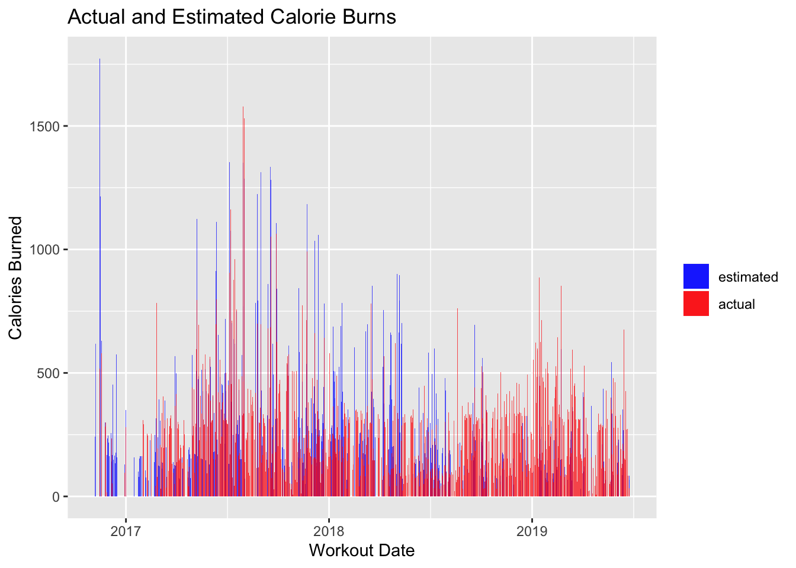

``` r
df['energy'] <- NA

# NA set to -1 for ease of comparison
e1 <- df[,3]
e1[which(is.na(e1))] <- -1
e2 <- df[,11]
e2[which(is.na(e2))] <- -1
e2 <- round(e2,0)


merge_calories <- function(x,y){
  # merge actual calories and calculated calories
  # if x is NA or 0, use the calculated y value.
  if (x==0 | x == -1){
    return (max(x,y))
  }
  return (x)
}

e <- mapply(merge_calories, e1, e2)
df['energy'] <- unlist(e)
df[which(df$energy==-1),'energy'] <- NA #replace -1 vals

df$totalEnergyBurned <- NULL
df$estTotalEnergyBurned <- NULL
 
# plot
# match app logo colors, darker colors for points
# used this site to darken colors:
# http://www.simonbattersby.com/blog/hex-to-rgb-rgb-to-hex-and-colour-shade-selector/
nike_color <- rgb(204/255, 255/255, 54/255)
nike_color_dark <- "#a3cc2b"
strava_color <- rgb(248/255,52/255,9/255)
strava_color_dark <- "#c62a07"
apple_watch_color <- rgb(223/255,223/255,223/255)
apple_watch_color_dark <- "#b2b2b2"
app_colors <- c(apple_watch_color, nike_color, strava_color)
app_colors_dark <- c(apple_watch_color_dark, nike_color_dark, strava_color_dark)


# zissou palette
z_blue <- rgb(18/255,138/255,206/255)
z_darkblue <- rgb(21/255,37/255,88/255)
z_red <- rgb(238/255,51/255,22/255)
z_gray <- rgb(182/255,195/255,198/255)
  

ggplot(df, aes(x=sourceName.x,y=totalDistance)) +
  geom_jitter(aes(color=sourceName.x), alpha=.75, show.legend = F) +
  scale_color_manual(values=app_colors_dark) +
  geom_boxplot(fill=app_colors, alpha=.7) +  
  stat_summary(geom="text", fun.y=median,
               aes(label=sprintf("%1.1f", ..y..)),
               position=position_nudge(x=0.5), size=3.5) +    
  theme_bw() +
  scale_x_discrete(labels=c("Apple Workout", "Nike+ Run Club", "Strava")) +  
  xlab("Workout App") +
  ylab("Distance (mi)") +
  ggtitle("Workout Distance per App")
```

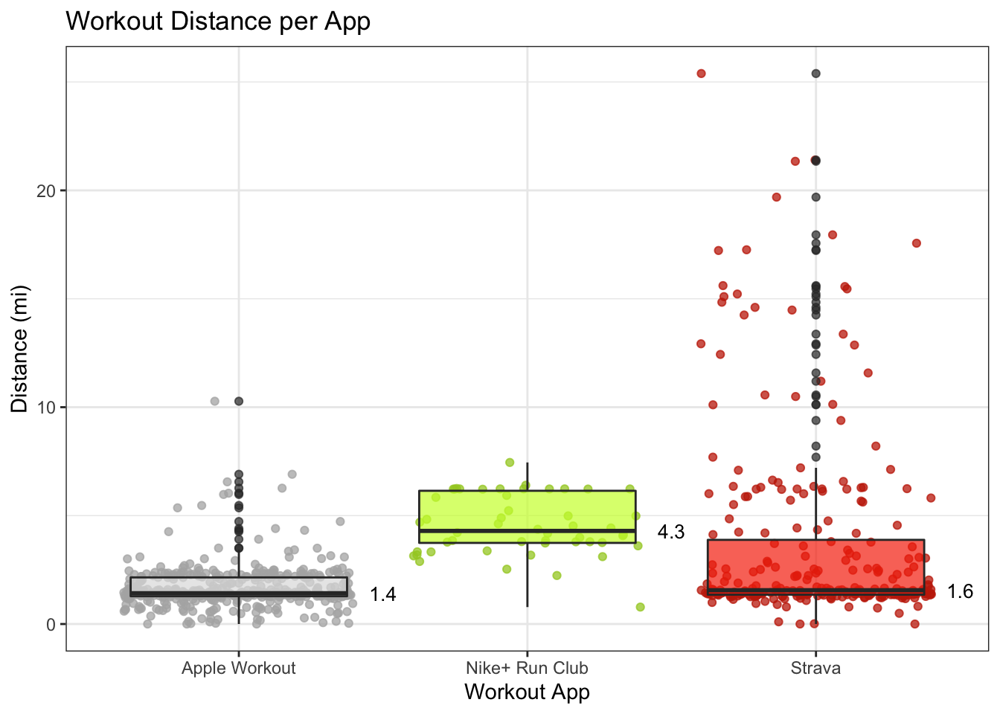

``` r
# workout duration distribution by workout type
# rowing, swimming, walking, and hiking are too small to consider
sport_df <- subset.data.frame(df, ! workoutType %in% c("swimming", "rowing", "walking", "hiking"))

ggplot(sport_df, aes(x=duration*60, y=..count..)) + 
  geom_histogram(aes(fill=workoutType), color='gray28', binwidth = 7, alpha=.75, show.legend = F) +
  scale_fill_viridis(discrete = T) +
  facet_wrap(~ workoutType) +
  xlab("Duration (min)") +
  ggtitle("Workout Duration by Workout Type")
```

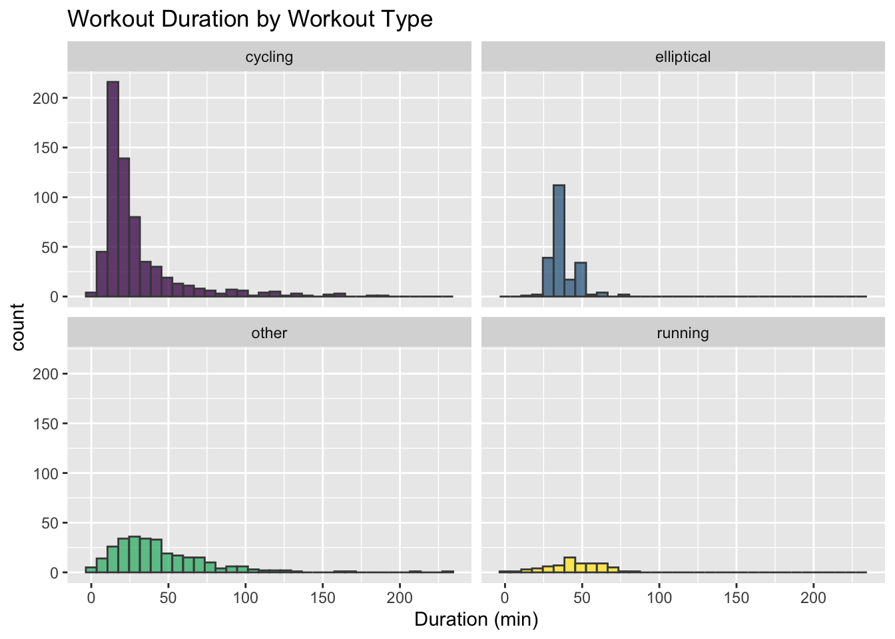

``` r
# Heart Rate Density by workout Type
ggplot(subset(sport_df,!is.na(hr_value)), aes(hr_value,y=..density..)) +
  geom_density(aes(fill=workoutType),alpha=.7, show.legend=F) +
  facet_wrap(~ workoutType) +
  scale_fill_viridis(discrete=T) +
  xlab("Heart Rate") +
  ggtitle("Heart Rate Density by Workout Type") 
```

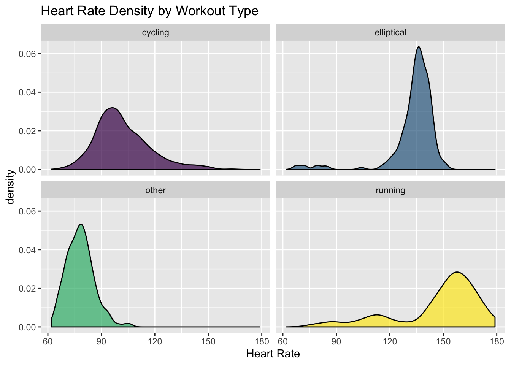

``` r
# fit a model to predict missing HR values
# taken from http://www.stat.columbia.edu/~gelman/arm/missing.pdf
  
hr_df <- subset.data.frame(sport_df, subset=is.na(workoutType)==F, select=c(workoutType,duration,totalDistance,energy,hr_value))

# binarize workout types
workoutTypes <- as.character(levels(sport_df$workoutType))
for(type in workoutTypes) {
  hr_df[type] = 0
}


for (i in 1:nrow(hr_df)){
  t <- as.character(sport_df$workoutType[i])
  hr_df[i,t] <- 1
}

lm.imputation <- lm(hr_value ~ energy + totalDistance, data=hr_df)

pred.hr <- predict(lm.imputation, hr_df)

impute <- function (a, a.impute){ 
  ifelse (is.na(a), a.impute, a)
}

hr.imp <- impute(sport_df$hr_value, pred.hr)

sport_df$imputed_hr <- round(hr.imp,0)
```

``` r
z <- sqldf("SELECT workoutTYpe, ymd, month, COUNT(*) AS count FROM df GROUP BY ymd")
zz <- aggregate(count ~ month, FUN = mean, data=z)
ggplot(zz,aes(month,count)) + 
  geom_bar(aes(fill=month),stat='identity', show.legend=F) +
  scale_fill_viridis(option="B",discrete=T) +
  ggtitle("Average Workouts per Day")
```

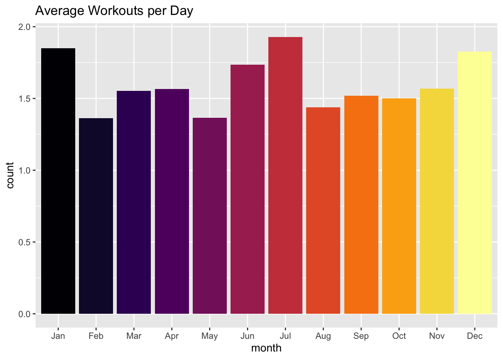

``` r
rm(z,zz)
```

``` r
# deterministic imputation of hr
p1 <- ggplot(mapping=aes(x=pred.hr, y=sport_df$imputed_hr)) + 
  geom_point(color=rgb(1, 1, 0), alpha=.4) +  
  ylab("Imputed HR") +
  xlab("Regression Prediction") +
  ggtitle("Deterministic Imputation of HR Variable") + theme_dark()

# Heart Rate Density by workout Type
p3 <- ggplot(sport_df, aes(y=..density..)) +
  geom_density(aes(x=hr_value, fill="actual"), alpha=.5, na.rm=T) +  
  geom_density(aes(x=imputed_hr, fill="imputed"), alpha=.5, na.rm=T) +  
  scale_fill_manual(values=c(rgb(1,0,0,.7),rgb(1,1,0,.7))) +  
  theme_bw() +
  facet_wrap(~ workoutType) +
  xlab("Heart Rate") +
  ggtitle("Heart Rate Density by Workout Type, Deterministic Imputation") +
  guides(fill=guide_legend(title="HR Data Source"))


# compare both imputation methods
grid.arrange(p1,p3)
```

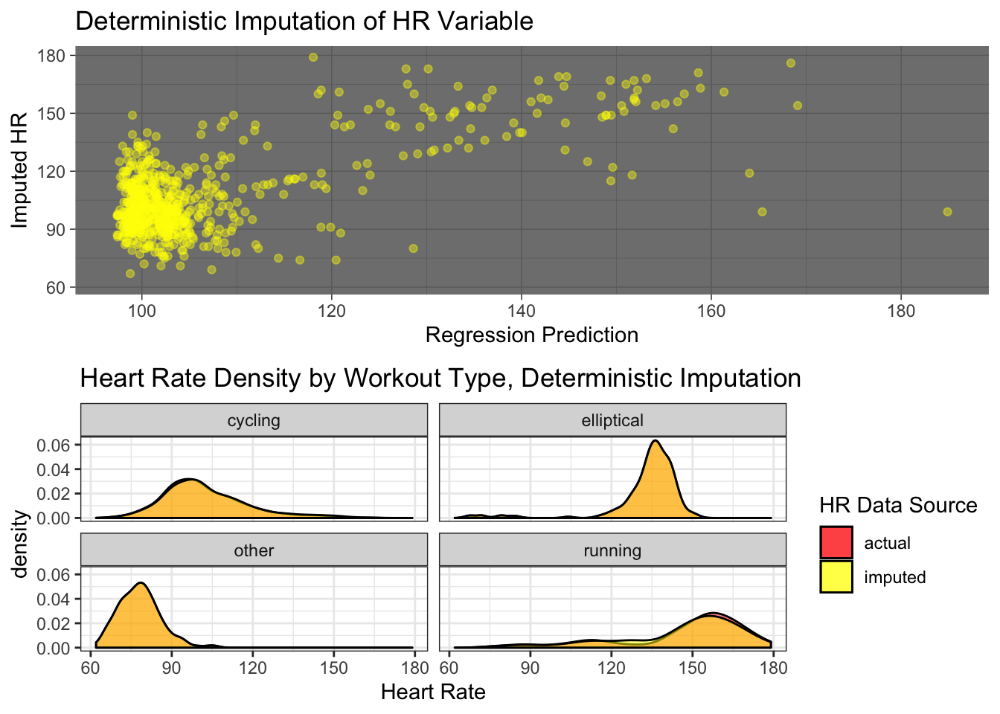

``` r
# random imputation of hr

pred.random.hr <- rnorm(nrow(hr_df), predict(lm.imputation, hr_df))
n_missing <- length(sport_df$hr_value[is.na(sport_df$hr_value)])
draw <- sample(pred.random.hr, n_missing)
random.hr.imp <- impute(sport_df$hr_value, draw)
sport_df$random_imputed_hr <- round(random.hr.imp,0)

p2 <- ggplot(mapping=aes(x=pred.random.hr, y=sport_df$random_imputed_hr)) + 
  geom_point(color='blue', alpha=.5) +
  ylab("Imputed HR") +
  xlab("Regression Prediction") +
  ggtitle("Random Imputation of HR Variable")

p4 <- ggplot(sport_df, aes(y=..density..)) +
  geom_density(aes(x=hr_value, fill='actual'),alpha=.5,na.rm=T) +
  geom_density(aes(x=random_imputed_hr, fill='imputed'),alpha=.5) +   
  scale_fill_manual(values=c(rgb(1,0,0,.7),rgb(0,0,1,.7))) +    
  facet_wrap(~ workoutType) +
  xlab("Heart Rate") +
  ggtitle("Heart Rate Density by Workout Type, Random Imputation") +
  guides(fill=guide_legend(title="HR Data Source"))

grid.arrange(p2,p4)
```

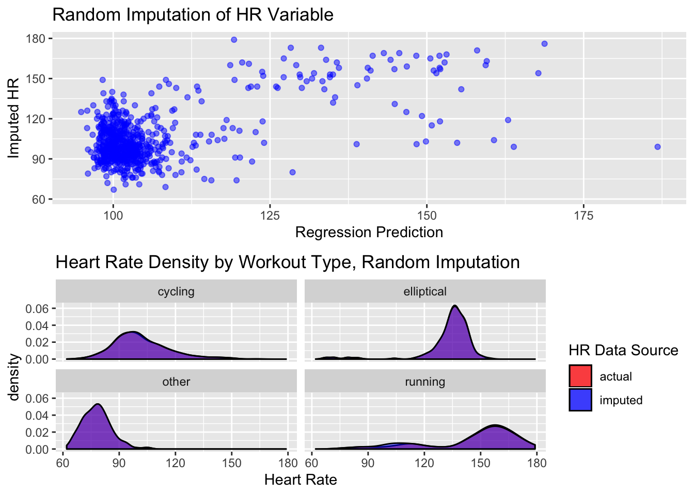

``` r
rm(df)

sport_df['id'] <- seq(1:nrow(sport_df))

final_df <- subset.data.frame(sport_df, select =c(id,duration,totalDistance,energy,sourceName.x, random_imputed_hr,workoutType))

colnames(final_df) <- c("id","duration","distance","energy","source","hr","activity")

# categorical to discrete numeric
# from: https://medium.com/data-design/visiting-categorical-features-and-encoding-in-decision-trees-53400fa65931
# 

final_df$source <- as.numeric(final_df$source)
# originally making factors of all workout types but wanted to only differentiate
# between a workout of 'other' vs. any other type
# final_df$activity <- as.numeric(as.factor(final_df$activity))
final_df$activity <- as.character(final_df$activity)
final_df$activity[final_df$activity != 'other'] <- '1'
final_df$activity[final_df$activity == 'other'] <- '0'
final_df$activity <- as.numeric(final_df$activity)

# missing data for distance, energy, hr
final_df[which(is.na(final_df$distance)),'distance'] <- 0
final_df[which(is.na(final_df$energy)),'energy'] <- median(final_df$energy,na.rm=T)
final_df[which(is.na(final_df$hr)),'hr'] <- median(final_df$hr, na.rm=T)

save(sport_df, file="data/after_effects_data.Rdata")
save(final_df, file="data/fit_data.Rdata")
write_csv(final_df, "data/fit_data.csv")
```
