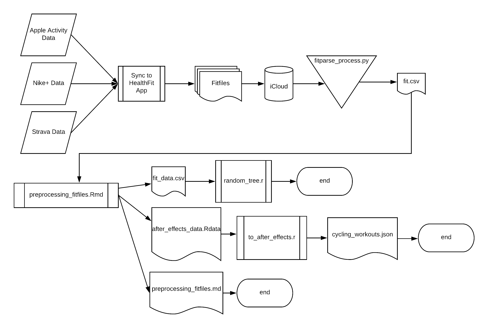

# Readme

**Author**: Matthew Hull

## Using the Apple Watch Workout Pipeline

- All watch workouts are automatically synced through the HealthFit app on iPhone
- Sources currently are Strava, Apple Activity, and Nike+
- After sync, HealthFit uploads exports each workout as a fitfile to iCloud with the extension .fit

Use `make` for the following steps:
- Run [fitparse_process.py](fitparse/fitparse_process.py) to grab all fitfiles and combine them with a common format into fit.csv
- Preprocess and clean aggregated data from fit.csv using [preprocessing.Rmd](preprocessing.Rmd). Using knit to pdf on the R Markdown workbook produces exploratory plots as well.
- Output of the preprocessing is fit_data.csv, after_effects_data.Rdata, and [preprocessing.md](preprocessing.md)
- Subset cycling data for use with an After Effects project using [to_after_effects.R](to_after_effects.R)

Use `make preprocess` to only run the preprocessing steps and output to after effects.

Preprocessing data visualization and notes can be seen [here](preprocessing.md)

- Use [random_tree.r](random_tree.r) to build random trees and random forests using classification on the fit_data.csv file.